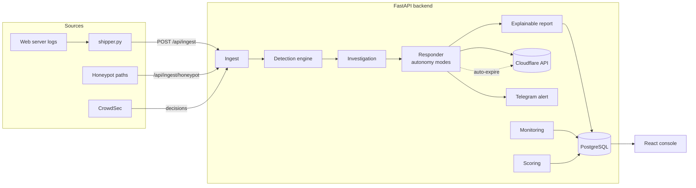

# AEGIS Lite 🛡️

**An autonomous cybersecurity platform for small businesses, built to be developed and operated by one founder on a near-zero budget.**

AEGIS Lite ingests your site's traffic, detects common attacks, autonomously responds (block / rate-limit / quarantine), writes an explainable report for every incident, and shows it all on a live dashboard — using only free and open-source components.

This repository is a **working skeleton**: the backend detection→response→report pipeline is implemented and tested (see `backend/tests/smoke.py`), with a React console and a one-command Docker deployment.

---

## ⚠️ Honest scope (read this)

AEGIS Lite is the realistic, achievable version of an "autonomous SOC." It does **not** include the enterprise fantasy (digital twin, ML brain, multi-tenant SaaS, SOC2). It does deliver, for free and solo:

- Detection of the 10 attack classes below, from web logs + honeypots.
- Autonomous IP blocking via Cloudflare, with **auto-expiry** (self-correcting), an **allowlist** so you never block yourself, and three **autonomy modes** (dry-run → approval → auto).
- A full **explainable report** per incident and a live **dashboard**.
- Uptime / SSL / security-header / response-time monitoring.

It is near-real-time (analyzes logs seconds after requests), so pair it with **Cloudflare's free WAF** (which blocks inline) and **backups**. Together that's a genuinely strong posture for a small business.

---

## What it detects

SQL Injection · XSS · Path Traversal · Brute Force · Credential Stuffing · Bot Attacks · Basic DDoS Patterns · Malware Uploads · API Abuse · Suspicious Login Behaviour · **Honeypot hits** (bonus).

---

## Architecture



Three moving parts: a **shipper** on the client's server feeds logs in; the **FastAPI backend** runs the closed loop (detect → investigate → respond → verify → report); the **React console** + **Telegram** surface it. Redis is used for fast counters/state when you scale beyond one worker.

---

## Detection pipeline

1. **Normalize** — log lines / JSON events → uniform records.
2. **Signatures** — regexes for SQLi, XSS, path traversal, malware uploads (matched on the URL-decoded path). `backend/app/detection/signatures.py`.
3. **Behavioral** — per-IP counters: failed logins (→ brute force / credential stuffing), 404 floods & path spread (→ scanning), API concentration (→ abuse), and a learned **EWMA baseline** z-score (→ rate anomaly / DDoS). `backend/app/detection/engine.py`.
4. **Honeypots** — any hit on a decoy path (`/.env`, `/wp-admin/...`) is auto-malicious.
5. **Correlate** — group findings by source IP into a single **incident** with a severity.

## Auto-remediation workflow

```
incident (severity ≥ threshold?) ── no ──▶ monitor only
        │ yes
        ▼
   allowlisted? ── yes ──▶ skip (never block your own infra)
        │ no
        ▼
   mode = dry-run ──▶ record "planned" (no real change)
   mode = approval ─▶ queue "pending_approval"  → you approve in UI/API
   mode = auto ─────▶ Cloudflare block IP → VERIFY → schedule auto-expire (TTL)
        ▼
   every action is written to the audit log
```

Auto-expiry (`BLOCK_TTL_HOURS`, default 24h) is the rollback: a mistaken block fixes itself. Start in `dry-run`, watch the reports, then graduate to `auto`.

## Explainable report format

Every incident's `report` field contains exactly:

```
Threat Type · Source · Target · Severity · Timeline · Actions Taken ·
Verification Result · Recommended Fixes · Final Status
```

plus structured extras (`root_cause`, `affected_endpoints`, `geo`, `request_count`).

---

## Tech stack

FastAPI · PostgreSQL · Redis · SQLAlchemy · httpx (backend) · React + Vite (frontend) · Docker Compose · Cloudflare Free · CrowdSec · Telegram · GitHub Actions. All free / open-source.

## Project structure

```
aegis-lite/
├── docker-compose.yml        # one command runs the whole stack
├── .env.example
├── db/init.sql               # canonical PostgreSQL schema
├── agent/shipper.py          # runs on the client server, ships logs to the API
├── backend/
│   ├── Dockerfile  requirements.txt
│   └── app/
│       ├── main.py           # FastAPI app + startup seeding
│       ├── config.py  database.py  deps.py
│       ├── models.py  schemas.py
│       ├── detection/{signatures,engine}.py
│       ├── investigation.py  # root cause, timeline, report
│       ├── integrations/{cloudflare,crowdsec,telegram,geoip}.py
│       ├── services/{ingest,responder,monitoring,scoring}.py
│       └── routers/api.py
│   └── tests/smoke.py        # CI detection test (passing)
├── frontend/                 # React + Vite console
│   └── src/{App.jsx,api.js,styles.css,main.jsx}
└── .github/workflows/ci.yml
```

## Database tables

`sites`, `events`, `incidents`, `actions`, `audit_log`, `monitoring_checks`, `allowlist`, `honeypots`. Full DDL in `db/init.sql`; ORM in `backend/app/models.py`.

## API endpoints

| Method | Path | Purpose |
|---|---|---|
| GET | `/health` | liveness + current autonomy mode |
| POST | `/api/ingest` | ingest events / log lines (the closed loop) 🔑 |
| GET | `/api/ingest/honeypot` | decoy trap endpoint |
| GET | `/api/incidents` | list incidents (filter by `status`) |
| GET | `/api/incidents/{id}` | full incident + explainable report |
| POST | `/api/incidents/{id}/resolve` | mark resolved 🔑 |
| POST | `/api/incidents/actions/{id}/approve` | approve a queued block 🔑 |
| GET | `/api/dashboard` | score, blocked, active, vulns, health, recent |
| POST | `/api/monitoring/check/{site_id}` | run uptime/SSL/header check 🔑 |
| GET | `/api/monitoring/crowdsec` | current CrowdSec ban decisions |
| POST | `/api/admin/sites` · `/allowlist` · `/honeypots` | management 🔑 |

🔑 = requires `X-API-Key` header.

---

## Integration workflows

**Cloudflare (autonomous blocking).** Create an API token with *Firewall Services: Edit* on your zone; set `CF_API_TOKEN` + `CF_ZONE_ID`. With `RESPONSE_MODE=auto`, high-severity incidents create an IP Access Rule, which is verified and auto-removed after the TTL. `integrations/cloudflare.py`.

**CrowdSec (community detection).** Install CrowdSec on the server (free); it bans scanners/brute-forcers locally and shares a community blocklist. Point `CROWDSEC_URL` + `CROWDSEC_API_KEY` at its LAPI; `/api/monitoring/crowdsec` surfaces its decisions, and its events can also be POSTed to `/api/ingest`.

**Telegram (alerts + weekly digest).** Make a bot via @BotFather, get your chat id, set `TELEGRAM_BOT_TOKEN` + `TELEGRAM_CHAT_ID`. High-severity incidents alert instantly. `integrations/telegram.py`.

**Wazuh (optional, deeper host monitoring).** For file-integrity / malware / ransomware indicators on the host, run single-node Wazuh (free) on a separate free VM and forward its alerts into `/api/ingest`.

---

## Run it locally (one command)

```bash
cp .env.example .env          # then edit API_KEY and any tokens
docker compose up --build
# backend  -> http://localhost:8000  (docs at /docs)
# frontend -> http://localhost:5173
```

Try the pipeline without any real site:

```bash
curl -X POST http://localhost:8000/api/ingest \
  -H "X-API-Key: <your API_KEY>" -H "Content-Type: application/json" \
  -d '{"site_id":1,"log_lines":[
    "203.0.113.10 - - [01/Jun/2024:12:00:00 +0000] \"GET /p?id=1 UNION SELECT pw FROM users-- HTTP/1.1\" 200 0 \"-\" \"sqlmap\""
  ]}'
```

Then open the console — the incident appears with its full report.

## Connect a real site (server-based)

On the client's server, schedule the shipper:

```bash
AEGIS_URL=https://aegis.yourdomain.com AEGIS_API_KEY=... \
LOG_PATH=/var/log/nginx/access.log \
*/1 * * * * python3 /path/agent/shipper.py   # via crontab -e
```

## Free hosting options

- **Backend + DB:** Oracle Cloud Always Free VM (Docker Compose), or Fly.io / Render free tiers + free Postgres (Neon/Supabase).
- **Frontend:** Cloudflare Pages / GitHub Pages / Netlify free.
- **Edge:** Cloudflare Free in front of everything.

---

## Step-by-step implementation plan

1. **Boot the stack** locally with Docker; confirm `/health` and the console load.
2. **Add the site** (`/api/admin/sites`) and your **allowlist** IP (so you never self-block).
3. **Wire the shipper** on the server; confirm events arrive and benign traffic stays clean.
4. **Connect Telegram**; confirm you get a test alert.
5. **Run in `dry-run`** for a week; read the reports, tune thresholds in `config.py`.
6. **Add Cloudflare** token; switch to `approval` mode (you click to block).
7. Once you trust it, switch high-severity to **`auto`**; keep medium in approval.
8. **Add CrowdSec** on the server for community-driven detection.
9. **Schedule monitoring** checks and the weekly digest.

## Development roadmap

- **MVP (done here):** ingest, 10-class detection, honeypots, autonomy modes, Cloudflare block + verify + expire, explainable reports, dashboard, Telegram, monitoring, CI.
- **v0.2:** monitoring scheduler (APScheduler), session-revocation adapter, upload-quarantine adapter, allowlist/honeypot UI, Redis-backed counters.
- **v0.3:** CrowdSec two-way sync, Wazuh ingestion, per-site dashboards, PDF report export, weekly digest automation.
- **v0.4 (first paid tier):** multi-site accounts, role logins, retention controls, simple billing — your path from tool to product.

## Extra features I added (you asked me to)

- **Honeypot decoys** — near-zero false-positive, high-signal detection (auto-seeded on first boot).
- **Self-protection allowlist** — never block your own IPs / monitoring / office.
- **Autonomy modes** (dry-run / approval / auto) — earn trust gradually; safe by default.
- **Auto-expiring blocks** — built-in rollback so mistakes self-heal.
- **Audit log** — every system/founder action recorded for accountability.
- **GeoIP enrichment** — location context per incident (free, no key).
- **Security score** — single 0–100 posture number for the dashboard.
- **Weekly Telegram digest** — stay informed without watching dashboards.

## Honest limitations

Log-based detection is near-real-time, not inline (Cloudflare's WAF does inline). Signatures can miss novel attacks and occasionally over-match — review reports and tune. This is a strong **small-business** tool and a real product foundation, not an enterprise platform. Start in dry-run; keep an allowlist; back up your site.
